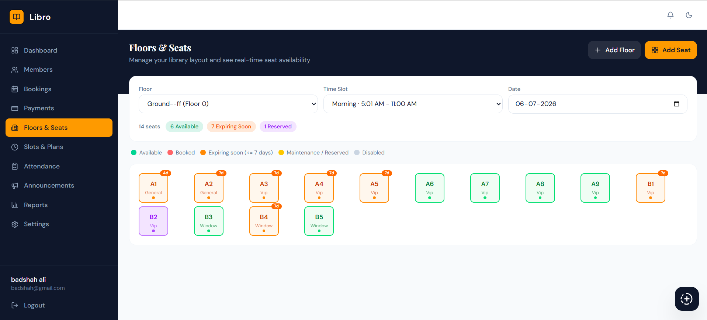
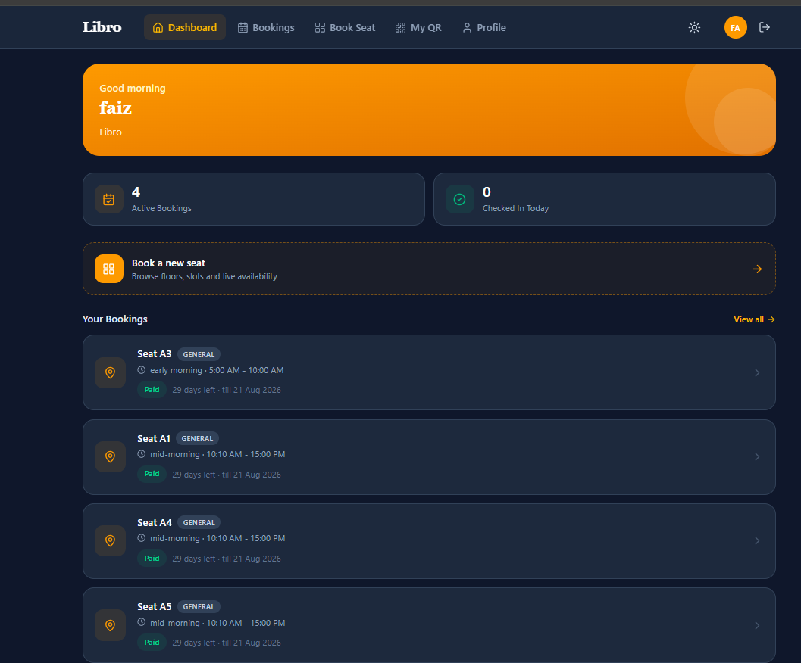

# Libro — Frontend

Frontend application for **Libro**, a full-stack library seat management system, built with React and Vite.

**Live Demo:** [libro-pink-six.vercel.app](https://libro-pink-six.vercel.app/)
**Backend Repo:** [github.com/Ajmat-Ali/Libro](https://github.com/Ajmat-Ali/Libro)

## Overview

This is the client-side application for Libro, supporting three distinct user roles with separate dashboards and workflows:

- **Owner** — reports, bookings, member management, and settings
- **Guard** — QR-based scan workflow for verifying member access
- **Student** — personal dashboard and profile management

## Features

- Login, registration, and OTP-based email verification
- Role-based dashboards (Owner / Guard / Student)
- Real-time overview cards and charts for bookings, occupancy, and attendance
- QR code scanning for guard-side access verification
- Fully responsive, Tailwind CSS-based UI

## Tech Stack

- **React** + **Vite**
- **Redux Toolkit** — global state management
- **React Router** — client-side routing
- **Tailwind CSS** — styling
- **Axios** — API requests
- **react-hook-form** — form handling & validation
- **html5-qrcode** — QR scanning

## Project Structure

<pre>
src/
├── api/ # API request modules
├── components/ # Reusable UI components
├── constants/ # Fixed/static data
├── hooks/ # Custom hooks
├── layouts/ # Owner & Student dashboard layouts
├── pages/ # Page-level views (auth, guard, owner, student)
├── routes/ # React Router configuration
├── shared/ # Common reusable components
├── store/ # Redux store & slices
└── utils/ # Helper functions </pre>

## Getting Started

### Prerequisites

- Node.js installed
- npm available in your terminal

### Installation

```bash
npm install
```

### Run Locally

```bash
npm run dev
```

Open the local URL shown in your terminal to view the app.

## Screenshot


</br>
</br>

